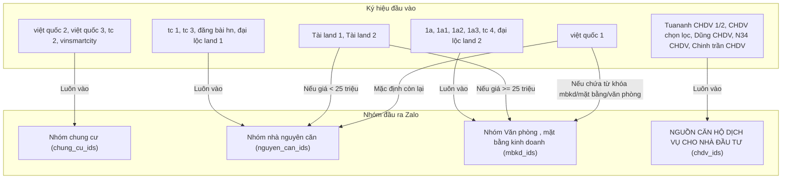

# Hướng Dẫn Hoạt Động Của Zalo Bot (Đầu Vào - Xử Lý - Đầu Ra)

Tài liệu này giải thích chi tiết cấu trúc dữ liệu đầu vào, các quy tắc chỉnh sửa/xử lý trung gian và đích đến đầu ra của Zalo Bot sau khi nâng cấp.

---

## 🛠️ 1. Đầu Vào (Input)

Nguồn dữ liệu đầu vào của bot được lấy từ các nhóm Zalo đối tác (được cấu hình trong [dauvao.txt](file:///c:/Users/Admin/Downloads/80chuan/bot/dauvao.txt)).

### Định dạng cấu hình trong [dauvao.txt](file:///c:/Users/Admin/Downloads/80chuan/bot/dauvao.txt):
```text
Tên Nhóm Đối Tác Zalo | Ký hiệu (Symbol)
```
*Ví dụ:*
- `Khu Vực Cầu Giấy - Nam Từ Liêm|Tài land 1` -> Khi nhận tin từ nhóm này, bot gán ký hiệu là `Tài land 1`.
- `Nguồn PANDA HOME🐼💎|11a1` -> Khi nhận tin từ nhóm này, bot gán ký hiệu là `11a1`.

---

## ⚙️ 2. Quy Tắc Chỉnh Sửa & Xử Lý Tin Nhắn (Processing Logic)

Mỗi tin nhắn khi đi qua bot sẽ được lọc và chuyển đổi dựa trên cấu hình cụ thể trong `_generate_rules()` tại [bot_utils.py](file:///c:/Users/Admin/Downloads/80chuan/bot/bot_utils.py):

| Ký hiệu (Symbol) | Quy tắc lọc tin nhắn (Filters) | Chỉnh sửa nội dung (Transformations) | Thứ tự truyền thông (Timeline Order) |
| :--- | :--- | :--- | :--- |
| **`1a1`, `1a2`, `1a3`** | ❌ Bỏ qua nếu tin nhắn **dưới 200 ký tự** | 🧹 Xóa hoa hồng<br>🏷️ Thêm mã đầu dòng `1a`<br>💵 Định dạng giá thành `Xtr` | Mặc định (Thông tin trước, ảnh sau) |
| **`11a1`** | - | 🧹 Xóa thưởng sale/ctv, xóa hoa hồng<br>🏷️ Thêm mã đầu dòng `11a`<br>💵 Định dạng giá thành `Xtr` | 🔄 Đăng thông tin trước, ảnh sau |
| **`11a2`, `11a3`** | - | 🧹 Xóa hoa hồng<br>🏷️ Thêm mã đầu dòng `11a`<br>💵 Định dạng giá thành `Xtr` | 🔄 Đăng thông tin trước, ảnh sau |
| **`9a`** | - | 🧹 Xóa hoa hồng<br>🏷️ Thêm mã đầu dòng `9a`<br>💵 Định dạng giá thành `Xtr` | 🔄 Đăng thông tin trước, ảnh sau |
| **`phongtot1` ➔ `5`** | - | 🧹 Xóa hoa hồng<br>🔗 Xóa link Facebook, Google Docs | Mặc định |
| **`npland`** | - | 🧹 Xóa hoa hồng<br>🏷️ Thêm mã | 📸 **Đăng ảnh trước, thông tin sau** |
| **`Tuananh CHDV 1/2`, `CHDV chọn lọc`, `Dũng CHDV`, `N34 CHDV`, `Chinh trần CHDV`** | - | 🧹 Xóa số liên lạc dòng cuối<br>🏷️ Thêm mã<br>💵 Định dạng giá thành `Xtr` | 📸 **Đăng ảnh trước, thông tin sau** |
| **`hm`** | 🚫 **Bỏ qua hoàn toàn** nếu nội dung chứa SĐT `"0366968234"` | 🏷️ Thêm mã đầu dòng | 📸 **Đăng ảnh trước, thông tin sau** |
| **`invest`, `family`** | - | 🧹 Xóa hoa hồng (chỉ family)<br>🏷️ Thêm mã | 📸 **Đăng ảnh trước, thông tin sau** |
| **`tc 2`, `tc 3`, `tc 4`** | - | 🧹 Xóa dòng liên hệ `lh...`<br>🏷️ Thêm mã đầu dòng | 📸 **Đăng ảnh trước, thông tin sau** |

### Các bộ lọc chung:
1. **Duyệt giá (`format_price`):** Chuyển đổi định dạng giá (ví dụ: `4.700.000` hoặc `3600k` ➔ `4tr7` hoặc `3tr6`).
2. **Xóa liên hệ (`remove_phone`):** Loại bỏ toàn bộ các dòng chứa số điện thoại đối tác, các chữ `liên hệ`, `lh`, `call`, `zalo`,... để tránh trỏ khách hàng về đối tác cũ.
3. **Xóa hoa hồng (`remove_commission`):** Loại bỏ các ký tự biểu thị hoa hồng như `%`, `hh`, `hoa hồng`, `sale`, `ctv`, các icon hoa 🌺, 🌹...

---

## 🎯 3. Đầu Ra & Định Tuyến (Output & Routing)

Đầu ra của bot sẽ chia làm 2 cơ chế định tuyến: **Định Tuyến Trực Tiếp Theo Nhóm Đặc Biệt** (bỏ qua quận/huyện) và **Định Tuyến Theo Quận/Huyện** (mặc định dựa vào địa chỉ trong bài đăng).

### Cơ Chế 1: Định Tuyến Trực Tiếp Theo Nhóm Đặc Biệt (Bỏ qua Quận/Huyện)
Các ký hiệu sau được định tuyến trực tiếp vào 4 nhóm đầu ra Zalo cố định:



### Cơ Chế 2: Định Tuyến Theo Quận/Huyện (Normal Routing)
Đối với các ký hiệu không thuộc danh sách định tuyến trực tiếp bên trên:
1. Bot trích xuất địa chỉ từ các trường `Địa chỉ:`, `Đ/c:`, hoặc 5 dòng đầu của tin nhắn.
2. So khớp với bộ từ khóa quận/huyện trong [daura.json](file:///c:/Users/Admin/Downloads/80chuan/bot/daura.json).
3. Gửi tin nhắn đến đúng nhóm Zalo tương ứng với quận/huyện được nhận diện (Ví dụ: `Cầu Giấy`, `Thanh Xuân`, `Đống Đa`,...).
4. Lưu trữ thông tin lịch sử gửi bài vào thư mục dữ liệu tương ứng của quận đó dưới dạng tóm tắt (`hadong.json`) và chi tiết (`hadong1.json`).
