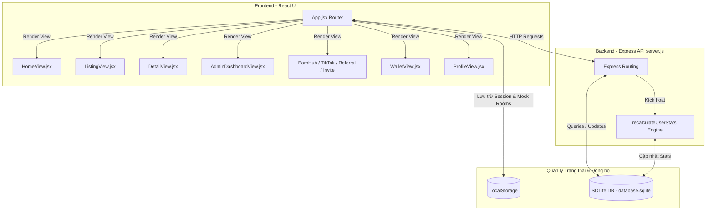
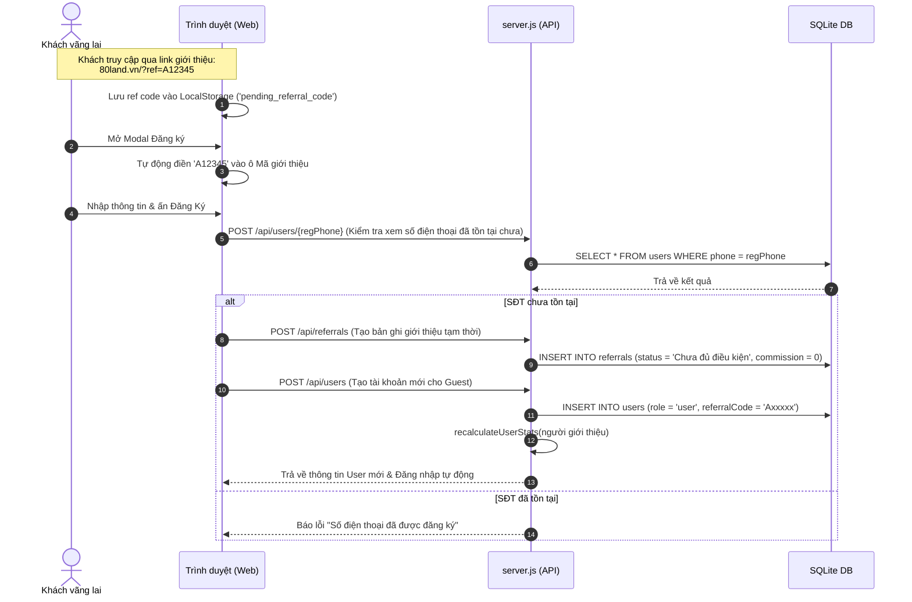
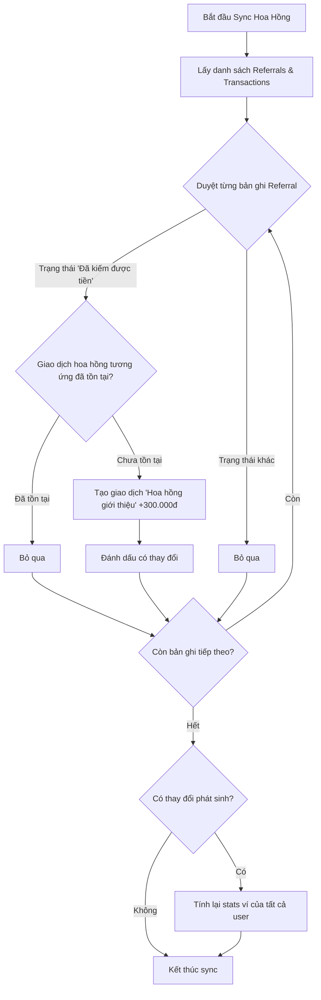

# Bảng Tóm Tắt Logic Hoạt Động & Kiến Trúc Hệ Thống 80Land

Tài liệu này hệ thống hóa toàn bộ cấu trúc mã nguồn, luồng dữ liệu, database và logic nghiệp vụ của dự án **80Land** dưới dạng sơ đồ và bảng logic trực quan, giúp lập trình viên nắm bắt dự án nhanh chóng mà không cần đọc hết mã nguồn.

---

## 1. Sơ Đồ Tổng Quan Kiến Trúc (Architecture Flow)

Sự tương tác giữa **Frontend (React/Vite)**, **LocalStorage (Đồng bộ tạm thời)** và **Backend (Node.js/Express + SQLite)**:

---

## 2. Bảng Phân Tích Cấu Trúc Các View (Màn Hình) & File Logic

| Tên File | Chức Năng Chính | Logic Nghiệp Vụ Quan Trọng | Dữ Liệu Tương Tác |
| :--- | :--- | :--- | :--- |
| [App.jsx](file:///c:/Users/Admin/Downloads/web-ha/src/App.jsx) | Router trung tâm & Quản lý trạng thái gốc | - Kiểm tra Responsive màn hình (`isMobile`). - Khởi tạo dữ liệu mặc định vào LocalStorage nếu chưa có. - Quản lý User Session (`currentUser`). - Định tuyến qua State `currentPage`. | `LocalStorage` (currentUser, rooms_db, transactions_db) |
| [server.js](file:///c:/Users/Admin/Downloads/web-ha/server.js) | Backend API Server & Database SQLite | - Khởi tạo SQLite Tables (`users`, `referrals`, `transactions`). - Chạy logic tự động tính lại số dư: `recalculateUserStats()`. - Cung cấp các API RESTful cho frontend. | `database.sqlite` |
| [AuthModals.jsx](file:///c:/Users/Admin/Downloads/web-ha/src/components/AuthModals.jsx) | Đăng nhập & Đăng ký | - Bắt mã giới thiệu (`ref`) từ URL/LocalStorage khi đăng ký. - Mã hóa ngẫu nhiên mã giới thiệu mới cho user dạng `A[xxxxx]`. - Tự tạo bản ghi giới thiệu `referrals` với trạng thái `Chưa đủ điều kiện`. | API `/api/users`, `/api/referrals` |
| [HomeView.jsx](file:///c:/Users/Admin/Downloads/web-ha/src/views/HomeView.jsx) | Trang chủ tìm kiếm & Khám phá | - Hiển thị bộ lọc nhanh phòng trọ, chung cư. - Chức năng lưu phòng nhanh (bookmark). - Điều hướng nhanh đến các khu vực kiếm tiền/phòng nổi bật. | Trạng thái phòng từ App.jsx |
| [ListingView.jsx](file:///c:/Users/Admin/Downloads/web-ha/src/views/ListingView.jsx) | Danh sách phòng theo danh mục | - Lọc phòng theo danh mục: Phòng trọ, Chung cư, Nhà nguyên căn, CHDV, Mặt bằng, Pass phòng, Ở ghép. - Bộ lọc nâng cao: giá cả, khu vực, diện tích. | Trạng thái phòng từ App.jsx |
| [DetailView.jsx](file:///c:/Users/Admin/Downloads/web-ha/src/views/DetailView.jsx) | Chi tiết phòng đăng | - Xem hình ảnh, mô tả chi tiết phòng. - Nút liên hệ nhanh qua Zalo chủ nhà/quản trị viên. | Thông tin phòng cụ thể |
| [WalletView.jsx](file:///c:/Users/Admin/Downloads/web-ha/src/views/WalletView.jsx) | Ví tiền & Lịch sử giao dịch | - Hiển thị số dư khả dụng, tổng thu nhập, hoa hồng chờ duyệt. - Tạo lệnh rút tiền gửi lên hệ thống. - Nút đồng bộ nhanh hoa hồng giới thiệu từ trang Referral. | API `/api/transactions`, `/api/sync-referrals` |
| [FriendInviteView.jsx](file:///c:/Users/Admin/Downloads/web-ha/src/views/FriendInviteView.jsx) | Trang mời bạn bè (Affiliate) | - Tạo link mời có chứa mã ref cá nhân. - Hiển thị danh sách bạn bè đã mời và trạng thái hoa hồng (300.000đ/ref thành công). | API `/api/referrals` |
| [AdminDashboardView.jsx](file:///c:/Users/Admin/Downloads/web-ha/src/views/AdminDashboardView.jsx) | Trang quản trị của Admin | - Quản lý phòng (Thêm/Sửa/Xóa). - Xem danh sách thành viên, số điện thoại, số dư ví. - Import/Export dữ liệu batch cho Referrals và Transactions. - Công cụ xóa trắng dữ liệu hoặc kích hoạt tính toán lại toàn bộ ví. | Toàn bộ API `/api/*` |

---

## 3. Bản Đồ Dữ Liệu Database (SQLite Schema)

Hệ thống quản lý dữ liệu thông qua 3 bảng chính trong SQLite:

### Bảng 1: `users` (Thông tin người dùng)
*   **`phone`** (TEXT PRIMARY KEY): Số điện thoại dùng làm tài khoản định danh.
*   **`password`** (TEXT): Mật khẩu đăng nhập.
*   **`name`** (TEXT): Họ tên hiển thị.
*   **`referralCode`** (TEXT UNIQUE): Mã giới thiệu riêng của user (ví dụ: `A12345`).
*   **`avatar`** (TEXT): Link ảnh đại diện.
*   **`role`** (TEXT): Quyền hạn (`admin` hoặc `user`).
*   **`walletBalance`** (INTEGER): Số dư ví khả dụng hiện tại.
*   **`totalEarned`** (INTEGER): Tổng số tiền đã kiếm được từ trước tới nay.
*   **`pendingCommissions`** (INTEGER): Hoa hồng đang chờ xử lý/duyệt.
*   **`totalReferrals`** (INTEGER): Tổng số người đã mời.
*   **`activeReferrals`** (INTEGER): Số người đã mời đang hoạt động/đã kiếm được tiền.

### Bảng 2: `referrals` (Danh sách giới thiệu)
*   **`id`** (INTEGER PRIMARY KEY AUTOINCREMENT)
*   **`referralCode`** (TEXT): Mã giới thiệu được áp dụng.
*   **`name`** (TEXT): Tên của người được giới thiệu.
*   **`phone`** (TEXT): Số điện thoại người được giới thiệu.
*   **`date`** (TEXT): Thời gian đăng ký.
*   **`status`** (TEXT): Trạng thái (`Chưa đủ điều kiện`, `Đã kiếm được tiền`, v.v.).
*   **`commission`** (INTEGER): Số tiền hoa hồng được nhận (mặc định là 300.000đ khi hoàn thành).

### Bảng 3: `transactions` (Lịch sử giao dịch tiền tệ)
*   **`id`** (INTEGER PRIMARY KEY AUTOINCREMENT)
*   **`phone`** (TEXT): Số điện thoại thực hiện giao dịch.
*   **`date`** (TEXT): Thời gian giao dịch.
*   **`type`** (TEXT): Loại giao dịch (`Rút tiền`, `Hoa hồng giới thiệu`, `Hoa hồng khách thuê`, `Hoa hồng TikTok`, v.v.).
*   **`amount`** (TEXT): Số tiền (Định dạng chuỗi chứa dấu âm/dương, ví dụ: `-500.000đ`, `+300.000đ`).
*   **`status`** (TEXT): Trạng thái giao dịch (`Thành công`, `Đang xử lý`, `Thất bại`).

---

## 4. Các Luồng Logic Nghiệp Vụ Cốt Lõi (Core System Flow)

### Luồng A: Đăng Ký và Ghi Nhận Mã Giới Thiệu (Referral Tracking)

---

### Luồng B: Tính Toán Số Dư & Đồng Bộ Ví (Wallet Balance Calculation Engine)

Mỗi khi có một giao dịch mới phát sinh hoặc khi admin yêu cầu đồng bộ, hàm **`recalculateUserStats(phone)`** trong `server.js` sẽ chạy theo cơ chế sau:

1.  **Đọc toàn bộ lịch sử giao dịch:**
    Lấy danh sách các giao dịch thuộc số điện thoại đó: `SELECT * FROM transactions WHERE phone = ?`
2.  **Chuẩn hóa số tiền chuỗi sang số thực:**
    Chuyển đổi các chuỗi dạng `+1.120.000đ` hay `-500.000đ` thành số thực `1120000` và `-500000`.
3.  **Cộng trừ dòng tiền:**
    *   `totalEarned` = Tổng các khoản tiền nhận vào (số dương).
    *   `totalWithdrawn` = Tổng các khoản tiền đã rút ra (trị tuyệt đối của các số âm).
    *   `walletBalance` = `totalEarned` - `totalWithdrawn` (Không nhỏ hơn 0).
4.  **Cập nhật thống kê giới thiệu:**
    *   Đếm tổng số giới thiệu: `SELECT COUNT(*)` từ bảng `referrals` có mã giới thiệu của user.
    *   Đếm số giới thiệu hoạt động: Lọc các bản ghi có trạng thái `Đã kiếm được tiền`.
5.  **Ghi đè lại bảng `users`:**
    Chạy lệnh `UPDATE users` lưu lại các chỉ số mới tính toán vào cơ sở dữ liệu.

---

### Luồng C: Đồng Bộ Hoa Hồng Giới Thiệu (Referral to Transaction Sync)

Để đảm bảo người giới thiệu nhận được tiền khi bạn bè hoàn thành điều kiện, hệ thống có API `/api/sync-referrals`:

---

> [!TIP]
> **Tài khoản test nhanh:**
> - Tài khoản **Admin**: Đăng nhập bằng `admin` / mật khẩu `admin`.
> - Tài khoản **User test**: Đăng nhập bằng `user` / mật khẩu `user`.
> 
> Hệ thống sử dụng cơ chế lưu trữ kết hợp: ghi nhận tức thời dữ liệu UI vào `LocalStorage` để đảm bảo tốc độ phản hồi mượt mà ở phía client, song song gửi các yêu cầu đồng bộ bền vững về `database.sqlite` ở phía backend.
